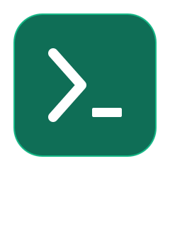

# vyt

<p align="center">
  
</p>

`vyt` is a small C wrapper around [`yt-dlp`](https://github.com/yt-dlp/yt-dlp)
and [`mpv`](https://mpv.io/) that makes searching and playing YouTube media
fast & simple from the terminal.

`vyt` never shells out through `system()` commands run via `fork` +
`execvp`, so URLs and search queries are passed as arguments, not
interpolated into a shell string.

**Platform:** Linux only (for now).

## Build & install

```sh
git clone https://github.com/E-Vex/vyt.git
cd vyt
make            # builds ./vyt
make install    # installs to ~/.local/bin/vyt
```

Make sure `~/.local/bin` is on your `PATH`.

## Usage

```
Usage:
  vyt -m URL
  vyt -v URL
  vyt -s QUERY
  vyt -h

Options:
  -m URL    Play YouTube URL as music (audio only, via mpv --no-video)
  -v URL    Play YouTube URL as video (via mpv)
  -s QUERY  Search YouTube for QUERY (via yt-dlp, top 10 results)
  -V        Print the version
  -h        Show this message :D
```

### Examples

```sh
# Play a video
vyt -v "https://youtube.com/watch?v=dQw4w9WgXcQ"

# Play just the audio
vyt -m "https://youtube.com/watch?v=dQw4w9WgXcQ"

# Search and pick a result
vyt -s "lofi hip hop radio"
```

<!-- NOTE: I assumed `-s` lists the top 10 results and lets you pick one
     by number before playing. Adjust this section to match the real
     interactive flow if it's different. -->

## Dependencies

- [`yt-dlp`](https://github.com/yt-dlp/yt-dlp) and [`mpv`](https://mpv.io/),
  both available on your `PATH`
- A C17 compiler (`gcc` or `clang`)
- `make`
- Linux (not currently tested/supported on macOS or Windows)

## Tests

```sh
make test
```

## Uninstall

```sh
rm ~/.local/bin/vyt
```

<!-- NOTE: I assumed there's no `make uninstall` target yet — swap this
     for `make uninstall` if you add one to the Makefile. -->

## LICENSE

  [MIT](LICENSE)